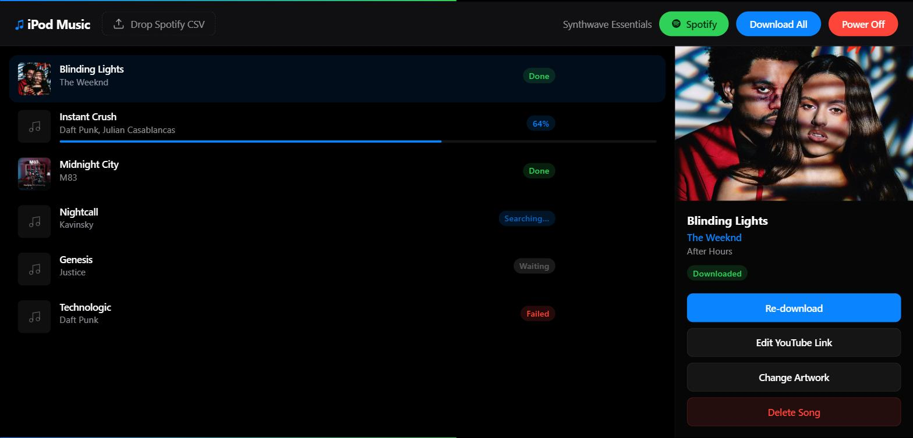

# 🎵 iPod Revival

**Dug your old iPod out of a drawer? Give it a new library in minutes.**

Turn any Spotify playlist into a tagged, cover-art-complete music folder — ready to load onto your iPod. No iTunes. No Apple Music subscription. No "unsupported format" errors. Just a playlist in, a folder of properly tagged `.m4a` files out.



## What it does

- 📋 Drop a CSV export of a Spotify playlist in, and it downloads every track as audio
- 🏷️ Automatically tags each file with title, artist, album, and track number
- 🖼️ Automatically finds and embeds matching cover art (via iTunes's public catalog)
- 📊 Live progress for every track, over a web UI you run on your own machine
- 🔊 Preview tracks right in the browser before they go on your device
- 🔗 Didn't find the right song? Paste your own YouTube link and it re-downloads from that instead
- 🗑️ Delete a track you don't want, re-download one that failed, all from the same screen

Nothing leaves your computer except the search/download requests themselves — there's no account, no cloud service, no tracking.

## Quick start

### 1. Install the prerequisites

| Tool | Why | Get it |
|---|---|---|
| **Python 3.10+** | runs the app | [python.org/downloads](https://www.python.org/downloads/) |
| **ffmpeg** | converts audio to iPod-friendly `.m4a` | `winget install ffmpeg` (Windows) · `brew install ffmpeg` (Mac) · `apt install ffmpeg` (Linux) |
| **yt-dlp** | finds and downloads the audio | `pip install yt-dlp` |

### 2. Download this project and install its dependencies

```bash
git clone https://github.com/RoKenobi/ipod-revival.git
cd ipod-revival
pip install -r requirements.txt
```

### 3. Run it

```bash
python app.py
```

Then open **http://127.0.0.1:4445** in your browser. Leave the terminal window open while you use it.

### 4. Get a playlist CSV

Go to [exportify.net](https://exportify.net), log in with Spotify, and export any playlist as a CSV file. (Free, no install, takes 10 seconds.)

### 5. Load it and download

Drag the CSV onto the app, then click **Download All**. Watch the list fill in — each track is searched on YouTube, downloaded, tagged, and given cover art automatically. If a specific song can't be found, click its link icon to paste a YouTube URL manually.

### 6. Get the files onto your iPod

Your finished tracks are in the `downloads/<playlist name>/` folder, already tagged with title/artist/album/cover art. From there:

- **Classic iPods (Click Wheel, Nano, etc.):** use [iTunes](https://support.apple.com/itunes) (Windows) or the **Music** app (Mac) to drag the folder into your library, then sync as usual — or use a lighter third-party tool like [iMazing](https://imazing.com/) if you'd rather not deal with iTunes's library management.
- **iPod set to "manually manage music" / disk mode:** just drag the files straight onto the device in Finder/Explorer.

## Optional: skip the CSV entirely

If you'd rather not export a CSV by hand, the app has a **Spotify** button that can import a playlist directly. This needs your own free Spotify developer app:

1. Register one at the [Spotify Developer Dashboard](https://developer.spotify.com/dashboard).
2. Set its **Redirect URI** to exactly `http://127.0.0.1:4445/api/spotify/callback`.
3. Copy `.env.example` to `.env` and fill in the `SPOTIFY_CLIENT_ID` / `SPOTIFY_CLIENT_SECRET` it gives you.

> **Note:** Spotify requires the account that owns *your* developer app to have an active Premium subscription before it will allow any API calls, even to read your own playlists. If that's not the case for you, the CSV method above works identically with no such restriction — it's the recommended path for most people.

## Configuration

Everything works with zero configuration out of the box. To override anything, copy `.env.example` to `.env`:

| Variable | Default | What it does |
|---|---|---|
| `PORT` | `4445` | Port the web UI runs on |
| `DOWNLOAD_FOLDER` | `./downloads` | Where finished tracks are saved |
| `YT_DLP_PATH` / `FFMPEG_PATH` | auto-detected from PATH | Only needed if those tools aren't on your PATH |
| `SPOTIFY_CLIENT_ID` / `SPOTIFY_CLIENT_SECRET` | — | Only needed for the optional direct-import feature above |

## A note on how this works

This app searches YouTube for the closest match to each track and downloads the audio, the same way many other open-source tools do. It's intended for personal use on music you already have the right to listen to (e.g. an existing Spotify subscription) — please respect copyright and the terms of service of any platform you use it with.

## License

[MIT](LICENSE) — do whatever you like with it.
